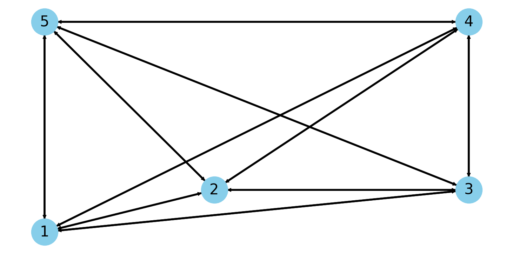

<!-- Before submitting your code, please delete the above code contribution
instructions and this comment as they will not be relevant in your code 
example README.md.-->
# About
This project was used to interface my Quantum Annealing Algorithm with the DWave API
The algorithm solves the Traveling Salesman Problem which is inputted as a matrix to the algorithm 

The project was my submission for ISEF 23' and an improved version was submitted to JSHS 24'
# Traveling Salesman Problem
The Taveling Salesman Problem asks" Given a list of cities and the distances between each pair of cities, what is the shortest possible route that visits each city exactly once and returns to the origin city?" and is a classic example of an NP hard problem. Below you can see an example

The problem can then be encoded in a matrix


##Algorithm

## Usage

Use
```bash
python RunQUBO.py
```
to run a basic QUBO example on the DWave API. THe output can then be seen either on the DWave Dashboard or you can view it locally with 
```python
dwave.inspector.show(sample_set)
```
## Code Overview

There are a few scripts in the project

* [RunQUBO.py](RunQUBO.py) serves as the main script in the project, it takes the QUBO coeffiecents either genreate by another script or manually hardcoded and runs them on the API
* [DynamicGen.py](DynamicGen.py) will genreate the QUOB equation using the penalty functions for the algorithm

## References

A. Mahasinghe, A., Hua, R., Dinneen, M. J., & Goyal, R. (2019). Solving the hamiltonian cycle problem using a
quantum computer. Proceedings of the Australasian Computer Science Week Multiconference, 1–9.


## License

Released under the Apache License 2.0. See [LICENSE](LICENSE) file.
